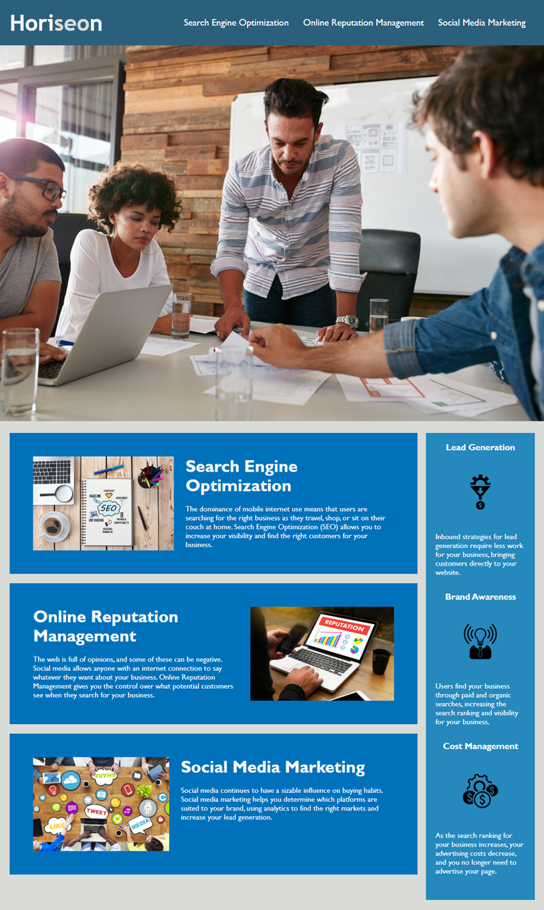

# Code-refactor-RyanLee

For this project a company called Horiseon wanted a user friendly website. Of the three links one was broken and I wasable to fix the link to where it was properly working. When viewing the source code I found that it was written in Non-Semantic HTML, I changed it to Semantic HTML so that it was easier to read for any future programmers that need to make changes to the source code. Finally i cleaned up and consolidated repetative code.

https://ryanofmordor.github.io/Code-refactor-RyanLee/

